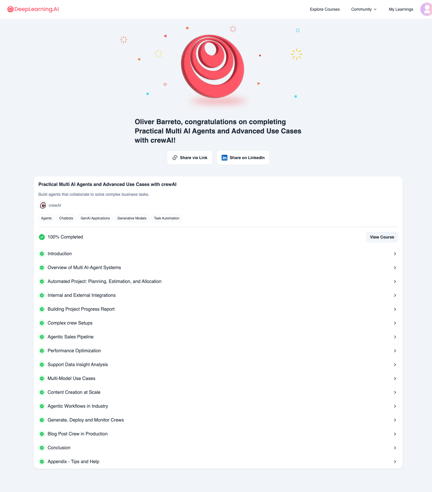

# Deeplearning.ai - Course - Practical Multi AI Agents and Advanced Use Cases with crewAI
- Course Online: https://learn.deeplearning.ai/courses/practical-multi-ai-agents-and-advanced-use-cases-with-crewai/
- Git repo: [deeplearning.ai.crewai.practicalmultiagents](https://github.com/oliverbarreto/deeplearning.ai.crewai.practicalmultiagents.git)
- Jupiter Notebooks of the course
- Finished: 15 diciembre 2024

# Course content:
- Lesson 1. Introduction
- Lesson 2. Overview of Multi AI-Agent Systems
- Lesson 3. Automated Project: Planning, Estimation, and Allocation (Code)
- Lesson 4. Internal and External Integrations (Code)
- Lesson 5. Building Project Progress Report 
- Lesson 6. Complex crew Setups (Code)
- Lesson 7. Agentic Sales Pipeline
- Lesson 8. Performance Optimization (Code)
- Lesson 9. Support Data Insight Analysis
- Lesson 10. Multi-Model Use Cases (Code)
- Lesson 11. Content Creation at Scale
- Lesson 12. Agentic Workflows in Industry
- Lesson 13. Generate, Deploy and Monitor Crews
- Lesson 14. Blog Post Crew in Production
- Lesson 15. Conclusion
- Lesson 16. Appendix - Tips and Help

